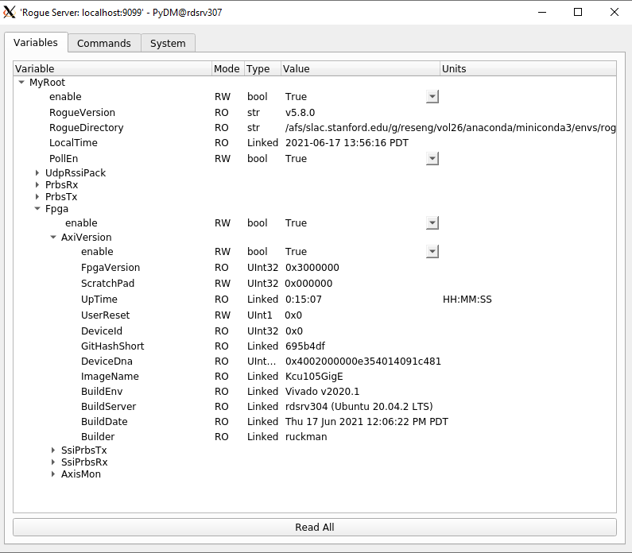
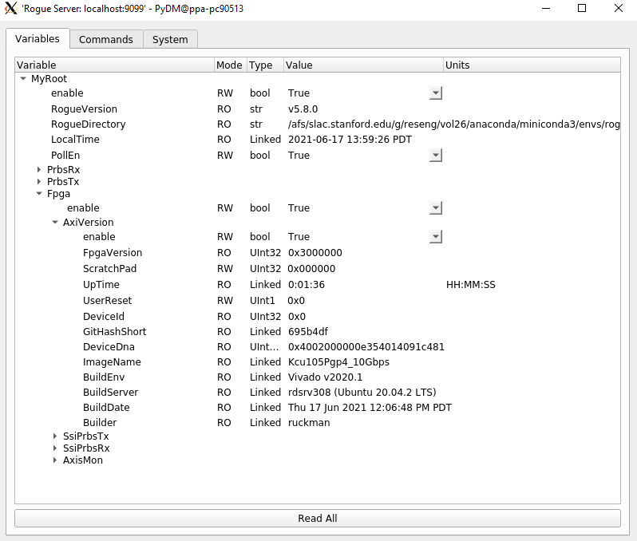

# dev-board-examples

Development Board Firmware/Software Examples

<!--- ########################################################################################### -->

# Before you clone the GIT repository

1) Create a github account:
> https://github.com/

2) On the Linux machine that you will clone the github from, generate a SSH key (if not already done)
> https://help.github.com/articles/generating-a-new-ssh-key-and-adding-it-to-the-ssh-agent/

3) Add a new SSH key to your GitHub account
> https://help.github.com/articles/adding-a-new-ssh-key-to-your-github-account/

4) Setup for large filesystems on github

```bash
$ git lfs install
```

5) Verify that you have git version 2.13.0 (or later) installed 

```bash
$ git version
git version 2.13.0
```

6) Verify that you have git-lfs version 2.1.1 (or later) installed 

```bash
$ git-lfs version
git-lfs/2.1.1
```

<!--- ########################################################################################### -->

# Clone the GIT repository

```bash
$ git clone --recursive git@github.com:slaclab/dev-board-examples
```

<!--- ########################################################################################### -->

# How to build the firmware 

1) Setup Xilinx licensing

> If you are on the SLAC network, here's how to setup the Xilinx licensing
  
```bash
$ source dev-board-examples/firmware/setup_env_slac.sh
```

> Else you will need to install Vivado and install the Xilinx Licensing

2) Go to the target directory and build the firmware via `make`:

> Example of building the KCU105 10 GbE firmware example target:

```bash
$ cd dev-board-examples/firmware/targets/XilinxKCU105DevBoard/Kcu105TenGigE
$ make
```

3) Optional: Review the results in GUI mode
```bash
$ make gui
```

<!--- ########################################################################################### -->

# How to install the Rogue With Anaconda

> https://slaclab.github.io/rogue/installing/anaconda.html

<!--- ########################################################################################### -->

# How to run the Software Development GUI for RUDP 

These instructions are for any of the Ethernet firmware build (1 GbE and 10 GbE):

```bash
# Go to software directory
$ cd dev-board-examples/software/rogue

# Setup conda environment
$ source /path/to/my/anaconda3/etc/profile.d/conda.sh

# Activate Rogue conda Environment (refer to "How to install the Rogue With Anacond section")
$ conda activate rogue_v5.8.0

# Launch the GUI in RUDP mode
$ python scripts/DevBoardGui.py --type rudp
```


<!--- ########################################################################################### -->

# How to run the Software Development GUI for PCIe 

These instructions are for any of the PCIe firmware build (PGP2b and PGPv4):

> https://github.com/slaclab/axi-pcie-core
> https://github.com/slaclab/pgp-pcie-apps

```bash
# Go to software directory
$ cd dev-board-examples/software/rogue

# Setup conda environment
$ source /path/to/my/anaconda3/etc/profile.d/conda.sh

# Activate Rogue conda Environment (refer to "How to install the Rogue With Anacond section")
$ conda activate rogue_v5.8.0

# Launch the GUI in PCIe mode
$ python scripts/DevBoardGui.py --type pcie
```


<!--- ########################################################################################### -->
